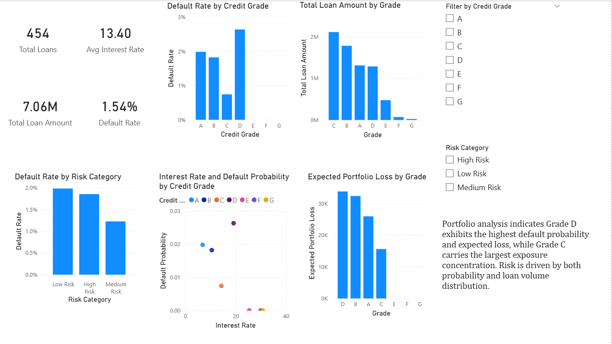

# Credit Risk Portfolio Analytics Dashboard

An interactive Power BI dashboard analysing credit risk patterns across a loan portfolio. Built to explore how credit grade, interest rate, and loan volume interact to drive default risk and expected portfolio loss.

## Dashboard Preview

### What is this project?
Imagine you are a bank manager overseeing millions in loans. Your primary goal isn’t just to see how many loans you have, but to identify **where** the money is at risk before a default happens. 

This project is a **Credit Portfolio Audit** designed to hunt for patterns in loan defaults. It transforms raw financial data into a strategic map that tells a bank exactly where their capital is safe and where it is under threat.

### Executive Summary: Finding the "Risk Gap"
After auditing 454 loans totaling $7.06M, I identified three critical areas where the data reveals hidden risks:

* **The Grade D Danger Zone:** While Grade A and B loans are stable, **Grade D loans** show the highest default probability. Even though they represent a smaller portion of the total volume, they contribute the most to the **Expected Portfolio Loss.**
* **The Interest Rate Breaking Point:** There is a clear threshold where higher interest rates no longer compensate for the risk. My analysis shows that as rates rise for certain grades, the default probability spikes aggressively.
* **Exposure Concentration:** Grade C carries the largest **Exposure Concentration.** This means the bank’s overall stability relies heavily on the performance of this one specific group.

### Technical Implementation (DAX & Data)

**Data Sourcing & Optimization**
The dataset was sourced from Kaggle and underwent **Stratified Sampling** to focus on a 454-record subset. This ensures high dashboard performance and fast "Time-to-Insight" while maintaining the original statistical distribution of the full credit portfolio.

**Complete DAX Formula Library**
I developed a suite of DAX measures to transform raw loan data into actionable financial intelligence. These formulas power every KPI card and chart in the dashboard:

**1. Core Portfolio Metrics**
* **Total Loans:** `Total Loans = COUNT(Loans[Loan_ID])`
* **Total Loan Amount:** `Total Balance = SUM(Loans[Loan_Amount])`
* **Average Interest Rate:** `Avg Interest = AVERAGE(Loans[Interest_Rate])`

**2. Risk & Performance Indicators**
* **Default Count:** `Defaults = CALCULATE(COUNT(Loans[Loan_ID]), Loans[Status] = "Default")`
* **Default Rate %:** `Default Rate = DIVIDE([Defaults], [Total Loans], 0)`
* **Expected Portfolio Loss:** `Expected Loss = SUMX(Loans, Loans[Loan_Amount] * [Default Rate])`

**3. Strategic Categorization (Logic)**
* **Risk Rank:** DAX
Risk Rank = 
SWITCH( TRUE(),
    [Default Rate] > 0.20, "High Risk",
    [Default Rate] > 0.10, "Medium Risk",
    "Low Risk"
)

## Author
Rithika Harikrishna
[LinkedIn](https://linkedin.com/in/rithika-harikrishna) · [GitHub](https://github.com/rithikahaha)
